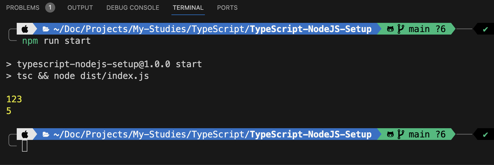
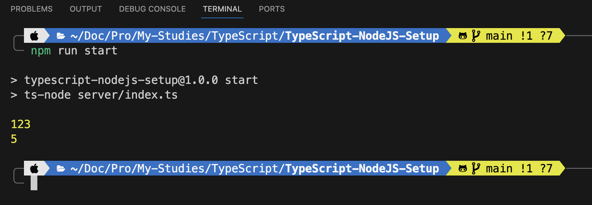

# TypeScript-NodeJS-Setup

TypeScript and NodeJS: The Proper Setup!

At very first we have to obtain our `package.json` configurations file with versions,
To that,

```sh
npm init -y
```

Then we should create our very first TypeScript File as `index.ts` at the project root.

Then after that we should change `"main": "index.js",` to `"main": "index.ts",` at the `package.json` file.
</br>

### Initialising TypeScript

To initialise TypeScript try,

```sh
npx tsc --init
```

But if you haven't install `TypeScript` before then you may encounter an error.

To install TypeScript,

```sh
npm install typescript
```

Then after try again `npx tsc --init`, it should work now
(It is recommended to kill your current terminal and Open a new terminal to avoid any issues)

### Coding

Now Let's add a simple code example to `index.ts`

```ts
console.log(123);

const addNumbers = (a: number, b: number) => {
  return a + b;
};

console.log(addNumbers(2, 3));
```

NodeJS haven't the ability to execute TypeScript by default,

So there are 2 main ways to overcome this situation

    Method - 01. Compile TypeScript to JavaScript.
    Method - 02. TypeScript & NodeJS Dependency.

***

*Before move on, let's create a new folder called `server` and move `index.ts` file into it.*


### $Method - 01:$

#### Compile TypeScript to JavaScript

As for the Method 01,
First you should create a new folder called `dist` which stands for distributable at the project root.

Then open `tsconfig.json` and change `"outDir": "./",` to `"outDir": "./dist",` And also make sure to uncomment it.

After that, simply open a new terminal and

```sh
tsc
```

after the line executed, now you will able to see an `index.js` file has been created inside `dist` folder & it includes a `JavaScript` code which obtained by compiling from `TypeScript` at `index.ts` file.

Well, sometimes it may be a horrible feeling when your wanted to run the project but each and every time you have to compile it at the terminal by `tsc` and run.

We can manage that situation by simply updating `package.json` file

```json
"scripts": {
    "start": "tsc && node dist/index.js"
},
```

By using the above `"tsc && node dist/index.js"`,
`tsc` helps to complie the `index.ts` and (`&&`) wait for complie then, execute `node dist/index.js`

Perfect, Now all we have to do run and test our TypeScript project completely setup with NodeJS

```sh
npm run start
```

#### Output:



### $Method - 02:$

#### TypeScript & NodeJS Dependency installation

By this Method 02,
We are able to Directly run TypeScript on NodeJS with the help of a dependency.

For this Method we have to go though a simple `npm` installation.

In terminal,
```sh
npm i ts-node -D
```

In here `-D` at the end of the code line is refers to as install only as a dependancy for the current production (project).

So if your using this 2nd Method,
no need to compile `TypeScript`, since this `ts-node` dependency helps us to directly run `TypeScript` with `nodejs` instead of converting into `JavaScript`.

Next open `package.json` file and,

```json
"scripts": {
    "start": "ts-node server/index.ts"    
},
```

😄 That's it, 
With this 2nd Method we can get rid from creating `dist` for compiling pourpose and also it helps us to speed up the project development phase by saving the time taken for compile to `js`.

Now Let's run the project

```sh
npm run start
```

#### Output:



</br>

***

##### Personal thought : 
Personally I prefer to proceed with the second method but it may vary depent on the situation which how we should apply based on the project scope or the tech-stack prefered to use for the project. 
Thanks & Regards...